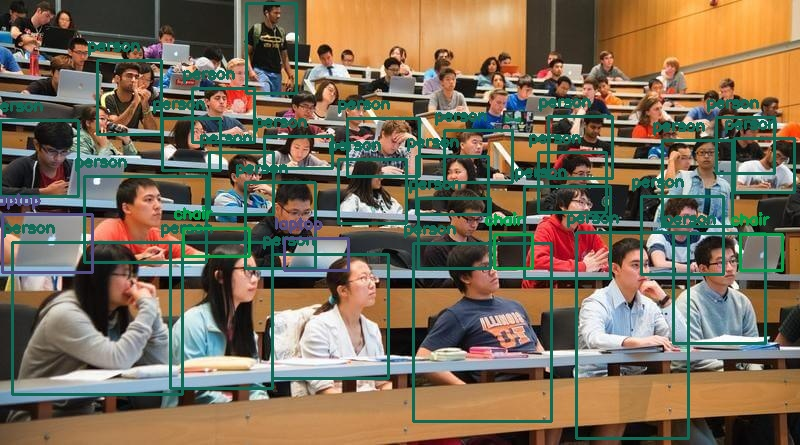

## Yolo v3 Object tracking for static images

### Usage

After you clone the repository.

1. Create a virtual enviroment

   ```bash
   python -m venv yolenv
   ```

2. Activate the enviroment

   ```bash
   cd yolenv
   cd Scripts
   activate.bat 
   ```

3. Install the required libraries

   ```bash
   pip install -r requirements.txt
   ```

4. Download the required file for the Yolo and put them on the folder yolo
  https://pjreddie.com/media/files/yolov3.weights

  https://raw.githubusercontent.com/pjreddie/darknet/master/cfg/yolov3.cfg (Right Click on link and Save link as.. )

  https://github.com/pjreddie/darknet/raw/master/data/coco.names (Right Click on link and Save link as.. )

5. Start using the script

   ```bash
   #For default image images/cl2.jpg and default class of interest person
   python yolo_images.py
   
   #For custom image path and default class of interest person
   python yolo_images.py images/cl2.jpg 
   
   #For custom image path and custom class of interest
   python yolo_images.py images/cl2.jpg person
   ```

The scipt automatically creates a file with the name ''object-detection.jpg'' and prints the total number of the detected oblects for the class of interest.

### Results

**Input image:**


**Output Image:**



**Terminal Output:**

```bash
Detected 27 items of class person.
```

